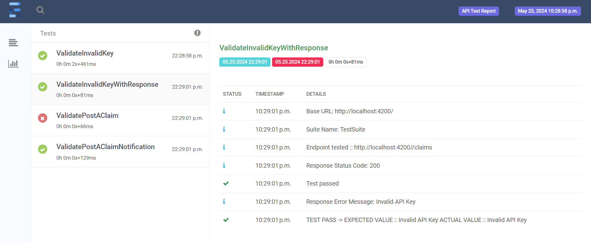

# APIUnderTestRestAssured

Test Automate get and post request for Application Under Test(AUT) https://github.com/vinitad12/APIUnderTest

[//]: # (to run test)

**To Run Test**

* `mvn test -Dsurefire.suiteXmlFiles=testng.xml -Dgroups=regression -DbaseUrl=http://localhost:4200/`
* `mvn test -Dgroups=sanity -DbaseUrl=http://localhost:4200/`
* `mvn test -DbaseUrl=https://vinidan.pythonanywhere.com/`

Report

